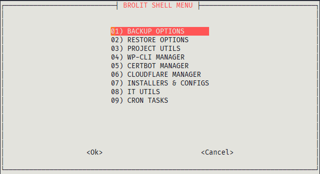

# LEMP Ubuntu Utils Scripts

"LEMP Ubuntu Utils Scripts" is a **BASH** script which can be used to automate backups (files and databases), restore backups, create clean installation of WordPress projects, and other useful tasks.
It's written in BASH scripting language.



## Main Features

* LEMP automated installer
* Files and database backups (MySQL or MariaDB)
* Upload backups to Dropbox (API v2)
* Restore backups from URL or Dropbox
* WordPress automated installer
* WP-CLI actions helper
* Let's Encrypt actions helper
* Monit installer and configuration helper
* Netdata installer and configuration helper
* Certbot installer and configuration helper
* Cockpit installer and configuration helper
* Cloudflare support (via API)
* PHP optimization tool (beta)
* Image optimization tools
* Blacklist checker
* Benchmark tools
* Malware scanners
* Simple step-by-step configuration wizard

## TODO List
[TODO List](./TODO.md)

## Supports

Works on Ubuntu 18.04 LTS and Ubuntu 20.04 LTS.

## Installation

If git is not installed:

```
sudo apt-get update && sudo apt-get install git -y
```

Configure the username, replace First Last:

```
git config --global user.name "First Last"
```

Configure the email, replace example@example.com:

```
git config --global user.email "example@example.com"
```

Cloning repo:

```
git clone https://gitlab.com/broobe/all-in-one-backup-script
```

Change directories to the new ~/all-in-one-backup-script directory:

```
cd ~/all-in-one-backup-script
```

## Getting started

Give the execution permission to the script:

```bash
 $chmod +x runner.sh
```

Run it:

```bash
 ./runner.sh
```

The first time you run `runner.sh`, you'll be guided through a wizard in order to configure it. This configuration will be stored in `~/.broobe-utils-script`.

## IMPORTANT

The script is based on this standard:

If you want to create a new web project for domain.com it will create:
* A database with name 'DOMAIN_STAGE' (the script will ask you the project state). Ex: midominio_prod
* A database user with name 'DOMAIN_user'. Ex: midominio_user
* A directory for the project files named 'domain.com'.
* A nginx configuration for 'domain.com'.

So, the restore script only works if this nomenclature is respected.

## Running as cron job
This script relies on a different configuration file for each system user. The default configuration file location is `root/.broobe-utils-script`.
This means that if you setup the script with your user and then you try to run a cron job as root, it won't work.
So, when running this script using cron, please keep in mind the following:
* Remember to setup the script with the user used to run the cron job
* Always specify the full script path when running it (e.g.  /path/to/dropbox_uploader.sh)

## Third Party Utils

LEMP Utils Script uses some third-party tools:

### Dropbox Uploader

Dropbox Uploader is a BASH script which can be used to upload, download, list or delete files from Dropbox, an online file sharing, synchronization and backup service.

### Google PageSpeed Insights API Tools

gitool.sh shell script to query Google PageSpeed Insights v4 & v5 API for site & origin metrics for FCP & DCL with additional support for GTMetrix & WebpageTest.org API tests

### Blacklist Checker

Blacklist check UNIX/Linux utility.

### Nench

VPS benchmark script — based on the popular bench.sh, plus CPU and ioping tests, and dual-stack IPv4 and v6 speedtests by default

## Contributing
Please read CONTRIBUTING.md for details on our code of conduct, and the process for submitting pull requests to us.

## Authors
* **Leandro Padula** - *Initial work* - [BROOBE](https://www.broobe.com)

## License
This project is licensed under the MIT License - see the [LICENSE](./LICENSE) file for details